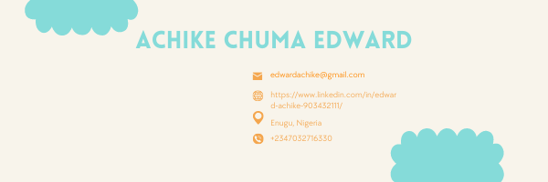

### Hi there, I'm Achike Chuma

I am a Fullstack/Mobile developer currently looking for opportunities to work with a great team. I enjoy working with React, Node, Python, RoR, Andriod and IoS technologies 

I am currently a student @ microverse and up untill recently, a network engineer @ University of Nigeria, Enugu campus.
 I am a Ciso Certified Network Associate (CCNA holder)/ an IBM certified cloud engineer.
I am a graduate of the University of Nigeria from the department of Electronic Engineering.

I enjoy playing/watching football (#Bayern) and always open to try new activities and continue learning from life. 

You can contact me on the following platforms
- Twitter: [@AchikeChuma](https://twitter.com/AchikeChuma)
- LinkedIn: [LinkedIn](https://www.linkedin.com/in/edward-achike-903432111/)
- Instagram: [chumaachike](https://www.instagram.com/chumaachike/)

<!--
**chumaachike/chumaachike** is a ✨ _special_ ✨ repository because its `README.md` (this file) appears on your GitHub profile.

Here are some ideas to get you started:

- 🔭 I’m currently working on ...
- 🌱 I’m currently learning ...
- 👯 I’m looking to collaborate on ...
- 🤔 I’m looking for help with ...
- 💬 Ask me about ...
- 📫 How to reach me: ...
- 😄 Pronouns: ...
- ⚡ Fun fact: ...
-->
